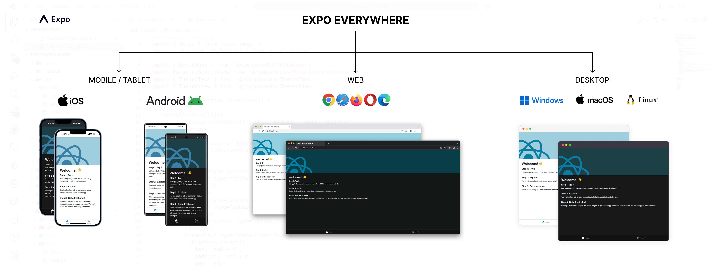

[](https://expo.dev/client)
[](https://github.com/younes-ammari/expo-everywhere/stargazers)
[](https://github.com/younes-ammari/expo-everywhere)
[](https://github.com/younes-ammari/expo-everywhere/generate)


# Expo Everywhere 🌍
# 

**Run your Expo app everywhere** - Web, Android, iOS, Windows, macOS, and Linux!

This is an [Expo](https://expo.dev) project enhanced with [Tauri](https://tauri.app) to create truly universal applications that run on every major platform. Built with [`create-expo-app`](https://www.npmjs.com/package/create-expo-app) and extended for desktop support.

## 🚀 Supported Platforms

- 📱 **Mobile** - Android & iOS
- 🌐 **Web** - Modern browsers
- 🖥️ **Desktop** - Windows, macOS, Linux 

## Get started

1. Install dependencies

   ```bash
   npm install
   ```

2. **Development Options:**

   ### Web Development
   ```bash
   npm run start:web
   # or
   npx expo start --web
   ```

   ### Mobile Development
   ```bash
   # Start development server
   npx expo start
   
   # Or target specific platforms
   npm run start:android
   npm run start:ios
   ```

   ### Desktop Development (Tauri)
   ```bash
   npm run start:desktop
   ```

## 📦 Building for Production

### Web
```bash
npm run build:web
```

### Desktop (All Platforms)
```bash
npm run build:desktop
```

### Mobile
Use [EAS Build](https://docs.expo.dev/build/introduction/) or [development builds](https://docs.expo.dev/develop/development-builds/introduction/) for mobile platforms.

## 🛠️ Development

You can start developing by editing the files inside the **app** directory. This project uses [file-based routing](https://docs.expo.dev/router/introduction).

The same React Native codebase powers all platforms:
- **Web & Mobile**: Expo handles the compilation and bundling
- **Desktop**: Tauri wraps the web build in a native desktop application

## 🎨 Desktop App Configuration

Desktop app settings are configured in `src-tauri/tauri.conf.json`. You can customize:
- App name and description
- Window size and behavior
- App icons and branding
- System permissions


## Learn more

### Expo Resources
- [Expo documentation](https://docs.expo.dev/): Learn fundamentals, or go into advanced topics with our [guides](https://docs.expo.dev/guides).
- [Learn Expo tutorial](https://docs.expo.dev/tutorial/introduction/): Follow a step-by-step tutorial where you'll create a project that runs on Android, iOS, and the web.

### Tauri Resources
- [Tauri documentation](https://tauri.app/): Learn about building desktop applications
- [Tauri API](https://tauri.app/reference/javascript/api/): Explore native desktop capabilities

## Join the community

Join our community of developers creating universal apps.

- [Expo on GitHub](https://github.com/expo/expo): View our open source platform and contribute.
- [Tauri on GitHub](https://github.com/tauri-apps/tauri): Explore the desktop framework
- [Discord community](https://chat.expo.dev): Chat with Expo users and ask questions.

## 📄 License

This project is licensed under the MIT License - see the [LICENSE](LICENSE) file for details.

### What does this mean?

The MIT License is a permissive license that allows you to:
- ✅ Use this project for commercial purposes
- ✅ Modify and distribute the code
- ✅ Use it in private projects
- ✅ Include it in other projects

The only requirement is that you include the original license and copyright notice in any copy of the software.
